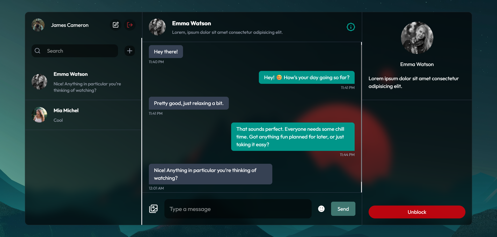

<div align="center">

[](https://reactjs.org/)
[](https://firebase.google.com/)
[](https://tailwindcss.com)
[](https://vitejs.dev/)
[](./LICENSE)
[](./CONTRIBUTING.md)

</div>

# ChatBuzz - A Social Messaging Platform

A sleek and feature-rich chat application built with React, Firebase, and TailwindCSS, featuring real-time messaging, user management, and a modern glassmorphism design.



## ✨ Features

- 🔐 **Authentication**

  - Email/password authentication
  - Profile picture upload during registration
  - Secure session management

- 💬 **Real-time Messaging**

  - Instant message delivery
  - Image sharing support
  - Message status indicators
  - Chat history preservation
  - Message search functionality

- 👥 **User Management**

  - User search and add
  - Profile customization
  - Block/Unblock users
  - Online status indicators

- 🎨 **Modern UI/UX**
  - Glassmorphism design
  - Responsive layout
  - Smooth animations
  - Toast notifications

## 🛠️ Technologies

- **Frontend:** React 19, TailwindCSS 4
- **State Management:** Zustand
- **Backend & Auth:** Firebase
- **Image Storage:** Cloudinary
- **Icons:** Lucide React
- **Notifications:** React Toastify
- **Build Tool:** Vite

## 🚀 Getting Started

### Prerequisites

- Node.js (version 16 or higher)
- npm or preferred package manager
- Firebase account
- Cloudinary account

### Installation

1. Clone the repository:

```bash
git clone <repo-url>
cd <project-directory>
```

2. Install dependencies:

```bash
npm install
```

3. Configure environment variables:

```env
VITE_API_KEY=your_firebase_api_key
VITE_AUTH_DOMAIN=your_firebase_auth_domain
VITE_PROJECT_ID=your_firebase_project_id
VITE_STORAGE_BUCKET=your_firebase_storage_bucket
VITE_MESSAGING_SENDER_ID=your_firebase_messaging_sender_id
VITE_APP_ID=your_firebase_app_id
VITE_CLOUDINARY_CLOUD_NAME=your_cloudinary_cloud_name
```

4. Start development server:

```bash
npm run dev
```

## 🎯 Key Features Explained

### Real-time Chat Implementation

- Uses Firebase Firestore for real-time updates
- Implements message status (sent, delivered, read)
- Handles image uploads via Cloudinary
- Supports emoji reactions

### User Management

- Firestore for user data storage
- Real-time online status tracking
- Block/unblock functionality
- User search with debouncing

### State Management

- Zustand for global state
- Separate stores for user and chat data
- Persistent authentication state
- Optimized re-renders

## 🚧 Challenges Faced and Solutions

### 1. Real-time Updates

- **Challenge:** Messages weren't updating in real-time consistently
- **Solution:** Properly implemented Firestore onSnapshot listeners and cleanup

### 2. Profile Updates

- **Challenge:** Profile updates weren't reflecting immediately across all components
- **Solution:** Implemented proper state management with Zustand and real-time listeners

### 3. Authentication Flow

- **Challenge:** Users could access protected routes before authentication completed
- **Solution:** Added proper loading states and route guards

## 🙏 Acknowledgments

- [Firebase Documentation](https://firebase.google.com/docs)
- [TailwindCSS](https://tailwindcss.com/)
- [Lucide Icons](https://lucide.dev/)
- [Cloudinary](https://cloudinary.com/)

## 👤 Author

_Monayem Hossain Limon_

[![Github][github-shield]][github-url]
[![LinkedIn][linkedin-shield]][linkedin-url]

[github-shield]: https://img.shields.io/badge/Github-000?style=flat&logo=github&logoColor=white
[github-url]: https://github.com/Limon00001
[linkedin-shield]: https://custom-icon-badges.demolab.com/badge/LinkedIn-0A66C2?logo=linkedin-white&logoColor=fff
[linkedin-url]: https://www.linkedin.com/in/monayem-hossain-limon/
